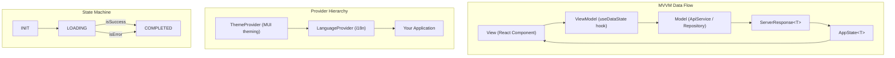

# Astra

A robust **React + Electron** library serving as a comprehensive boilerplate for building scalable web and desktop applications. It implements **MVVM (Model-View-ViewModel)** patterns, handles **localization**, manages **state** (stateless — transient only), and provides a solid foundation for **theming** and **API interactions**.

This library abstracts away the repetitive setup code so you can focus on your application's business logic.

> **For full documentation and AI context, see [docs/index.md](docs/index.md)** — the LLM-optimized knowledge map with module mapping, dependency stack, and file manifest.

## 🚀 Features

- **MVVM Architecture**: Built-in hooks to manage data fetching and state transitions cleanly.
- **State Management**: Structured application state handling (`INIT`, `LOADING`, `COMPLETED`, `ERROR`) — **stateless**, persistence delegated to consumer.
- **Localization (i18n)**: Ready-to-use `LanguageProvider` and context for multi-language support.
- **Theming**: Integrated Material UI (MUI) theme management with Light/Dark mode interaction.
- **API Repository**: A type-safe Axios wrapper for standardized API requests and error handling.
- **Electron Support**: First-class integration with Electron 28+ via context bridge pattern.
- **Atomic Design**: 47 UI components organized by Atomic Design tiers (Atoms, Molecules, Organisms, Templates).
- **Type Safety**: Fully written in TypeScript.

### What Astra Is Not

- **Not a UI framework** — Astra provides infrastructure; bring your own UI layer or use the included components
- **Not a state persistence library** — Astra is stateless; persistence (localStorage, SQLite, IndexedDB) is the consumer's responsibility
- **Not a design system** — Astra provides theming infrastructure but no branded design language
- **Not a backend** — Astra is purely client-side; it consumes APIs but does not provide server-side functionality

## 📦 Installation

To use this library in your project, add it to your `package.json`. Since this is hosted on GitHub, you can add it directly:

```json
"dependencies": {
  "astra": "git+https://github.com/NikhilVijayakumar/astra.git"
}
```

To target a specific version (tag), branch, or commit hash (recommended for production stability):

```json
"dependencies": {
  "astra": "git+https://github.com/NikhilVijayakumar/astra.git#v0.0.4"
}
```

Or if you are developing locally and linking it:

```json
"dependencies": {
  "astra": "file:../path/to/astra"
}
```

> **Note:** `astra` is open-source (`"private": false`) but currently GitHub-hosted. npm registry publishing is planned. In the meantime, use the git or file install methods above.

## 🚀 Quick Start

### 1. Install

```bash
npm install git+https://github.com/NikhilVijayakumar/astra.git
```

### 2. Wrap Providers

```tsx
import { ThemeProvider, LanguageProvider } from "astra";
```

See [Integration Guides](#integration-guides) for complete setup per framework.

### 3. Build Features

```tsx
import { useDataState, AppStateHandler } from "astra";
```

See the [MVVM Pattern](#3-consuming-data-mvvm-pattern) section below for a full example.

## 📜 Consumption Contract

Supported import styles:

```ts
import { ThemeProvider, spacing, HeroSection } from "astra";
```

```ts
import { spacing } from "astra/theme";
import { HeroSection } from "astra/components";
```

Notes:

- Root imports from `astra` remain the primary and recommended style.
- Subpath imports are supported only for the documented package export contract (`astra/theme`, `astra/components`, `astra/common`, and their `/*` variants).
- Direct imports into internal build output paths (for example `astra/dist/...`) are unsupported and may break without notice.

Migration guidance for older consumers:

- Replace any internal or alias-based imports with `astra` root imports where possible.
- If selective paths are needed, use only the declared subpaths above.

### Available Exports

**Core:**

- `ApiService` - Type-safe Axios wrapper
- `ServerResponse<T>` - Typed API response wrapper (`isSuccess`, `isError`, `data`, `status`, `statusMessage`)
- `HttpStatusCode` - HTTP status enum (`SUCCESS`, `CREATED`, `BAD_REQUEST`, `UNAUTHORIZED`, `NOT_FOUND`, `INTERNAL_SERVER_ERROR`, `INTERNET_ERROR`, `IDLE`)
- `getStatusMessage` - Localized status message helper
- `useDataState` - MVVM state management hook — returns `[appState, execute, setAppState]`
- `StateType` - State type enum (`INIT`, `LOADING`, `COMPLETED`)
- `AppState<T>` - State container type (`state`, `isError`, `isSuccess`, `status`, `statusMessage`, `data`)
- `AppStateHandler` - UI state handler component (props: `appState`, `SuccessComponent`, `emptyCondition`, `errorMessage`, `children`)
- `ThemeProvider` - MUI theming provider
- `ThemeToggle` - Theme mode toggle
- `useTheme` - Theme context hook (`darkMode`, `toggleDarkMode`)
- `LanguageProvider` - i18n provider
- `useLanguage` - i18n hook
- `LanguageSelector` - Language switch dropdown component

**UI Components** (47 components — see [detailed docs](docs/raw/feature/components/) for full API per component):

**Atoms** ([docs](docs/raw/feature/components/atoms/)): `StatusDot`, `SeverityBadge`, `LoadingState`, `ErrorState`, `EmptyState`

**Molecules** ([docs](docs/raw/feature/components/molecules/)): `Card`, `Notification`, `TrendMetricCard`, `ImageViewer`, `JsonViewer`, `MdViewer`

**Organisms** ([docs](docs/raw/feature/components/organisms/)): `DataTable`, `TimelineNode`, `FileTree`, `TerminalViewer`, `AudioPlayerBar`, `AnimatedHeroCharacter`, `CanvasNote`, `CanvasGroup`, `StatusActionCard`, `VersionHistorySelector`, `MultiPhaseWorkflowDiagram`, `FileViewerRouter`, `CsvViewer`, `EntryLayoutFrame`, `OperationHealthPanel`, `VerticalStepIndicator`, `InteractiveStepNode`, `FeatureSegmentCard`, `PlayableMediaCard`, `IconDescriptionListItem`, `ProfileRevealCard`, `StatusListRow`, `EntityConfidenceRow`, `AlertListItem`, `SummaryListItem`, `DecisionActionCard`, `WeeklyReportCard`, `ReviewDecisionDialog`, `MultiStepProgressIndicator`, `FormLayout`, `DrawerComponent`, `ToolbarComponent`

**Templates** ([docs](docs/raw/feature/components/templates/)): `PageHeader`, `SummaryPanel`, `HeroSection`

**Theme Utilities:**

- `spacing`, `typography`, `ThemeModeContext`

**Note:** Some internal exports may exist but are not part of the public API contract. Use only the exports listed above.

### 1. Theming Setup

Wrap your application with `ThemeProvider`. You need to provide your Light and Dark theme configurations (MUI Theme objects).

```tsx
import { ThemeProvider, ThemeToggle } from "astra";
import { createTheme } from "@mui/material/styles";

const lightTheme = createTheme({ palette: { mode: "light" } });
const darkTheme = createTheme({ palette: { mode: "dark" } });

function App() {
  return (
    <ThemeProvider lightTheme={lightTheme} darkTheme={darkTheme}>
      <ThemeToggle /> {/* Optional toggle button */}
      <YourMainComponent />
    </ThemeProvider>
  );
}
```

### 2. Localization Setup

Use `LanguageProvider` to manage translations.

```tsx
import { LanguageProvider } from "astra";

const translations = {
  en: { hello: "Hello World", welcome: "Welcome" },
  es: { hello: "Hola Mundo", welcome: "Bienvenido" },
};

const availableLanguages = [
  { code: "en", label: "English" },
  { code: "es", label: "Español" },
];

function App() {
  return (
    <LanguageProvider
      translations={translations}
      availableLanguages={availableLanguages}
      defaultLanguage="en"
    >
      <YourContent />
    </LanguageProvider>
  );
}
```

### 3. Consuming Data (MVVM Pattern)

Astra encourages the use of Repository pattern combined with the `useDataState` hook.

**Step 1: Create your API Service**

```ts
import { ApiService } from "astra";

const api = new ApiService("https://api.example.com", {
  internal_server_error: "Something went wrong on our end.",
});

export const UserRepo = {
  getUsers: () => api.get<User[]>("users"),
};
```

**Step 2: Use it in a Component**

```tsx
import { useDataState, StateType } from "astra";
import { useEffect } from "react";
import { UserRepo } from "./repo";

function UserList() {
  const [appState, execute] = useDataState<User[]>();

  useEffect(() => {
    execute(() => UserRepo.getUsers());
  }, []);

  if (appState.state === StateType.LOADING) return <div>Loading...</div>;
  if (appState.isError) return <div>Error: {appState.statusMessage}</div>;

  return (
    <ul>
      {appState.data?.map((user) => (
        <li key={user.id}>{user.name}</li>
      ))}
    </ul>
  );
}
```

### 4. Handling UI States (AppStateHandler)

For a cleaner UI that automatically handles `LOADING`, `ERROR`, and `EMPTY` states, use the `AppStateHandler` component.

```tsx
import { AppStateHandler, useDataState, StateType } from "astra";
import { useEffect } from "react";
import { UserRepo } from "./repo";

function UserList() {
  const [userState, fetchUsers] = useDataState<User[]>();

  useEffect(() => {
    fetchUsers(UserRepo.getUsers);
  }, []);

  return (
    <AppStateHandler
      appState={userState}
      SuccessComponent={({ appState }) => (
        <ul>
          {appState.data?.map((user) => (
            <li key={user.id}>{user.name}</li>
          ))}
        </ul>
      )}
      emptyCondition={(data) => data.length === 0}
      errorMessage="Unable to load users."
    />
  );
}
```

### 5. Electron Usage

For Electron 28+ desktop apps, access native APIs via the context bridge pattern:

```tsx
// preload.js — expose APIs to renderer
// contextBridge.exposeInMainWorld('electronAPI', {
//   getSettings: () => ipcRenderer.invoke('settings:get'),
//   saveSettings: (data) => ipcRenderer.invoke('settings:set', data),
// });

import { useDataState } from "astra";
import { useEffect } from "react";

function SettingsPage() {
  const [settings, loadSettings] = useDataState();

  useEffect(() => {
    loadSettings(() => window.electronAPI.getSettings());
  }, []);

  if (settings.isError) return <div>Failed to load settings</div>;
  return <pre>{JSON.stringify(settings.data, null, 2)}</pre>;
}
```

See [Electron integration guide](docs/raw/architecture/integration-contracts/electron.md) for complete setup.

## 🏗 Architecture

Astra follows **MVVM (Model-View-ViewModel)** with a **stateless** design.

### Layer Architecture



### State Flow

```
INIT → LOADING → COMPLETED | ERROR
```

Astra manages transient state only. Persistent state (localStorage, SQLite, IndexedDB) is the consumer's responsibility.

### Import Architecture

- **Root imports** (`import { X } from "astra"`) — primary and recommended
- **Subpath imports** (`astra/theme`, `astra/components`, `astra/common`) — supported
- **Internal/deep imports** (`astra/dist/...`) — unsupported, may break

See [docs/raw/architecture/core/](docs/raw/architecture/core/) for detailed architecture docs and [docs/raw/architecture/invariants/](docs/raw/architecture/invariants/) for architectural rules and compliance guidelines.

## 📁 Project Structure

The core logic resides in `src/common`:

- **`components/`**: Reusable UI components.
- **`hooks/`**: Custom hooks, primarily `useDataState` for MVVM state management.
- **`localization/`**: `LanguageProvider` and context for i18n.
- **`repo/`**: `ApiService`, `ServerResponse`, and networking types.
- **`state/`**: `AppState` type definitions (`INIT`, `LOADING`, `COMPLETED`).
- **`theme/`**: `ThemeProvider` and theming logic.

## 📚 Documentation

### Feature Documentation

- `docs/raw/feature/mvvm/` — MVVM architecture, pattern, and best practices
- `docs/raw/feature/repository/` — ApiService, ServerResponse, HttpStatusCode
- `docs/raw/feature/state/` — useDataState hook, AppStateHandler, state transitions
- `docs/raw/feature/localization/` — LanguageProvider, useLanguage, translation patterns
- `docs/raw/feature/theming/` — ThemeProvider, design tokens, theme customization
- `docs/raw/feature/components/` — Full component catalog by Atomic Design tier

### Architecture

- `docs/raw/architecture/core/` — Core architecture patterns (MVVM, state, hooks, repository, localization, theming)
- `docs/raw/architecture/invariants/` — Architectural rules and compliance guidelines
- `docs/raw/architecture/integration-contracts/` — Framework-specific integration guides

### Integration Guides

- `docs/raw/architecture/integration-contracts/getting-started.md` — Basic installation and setup
- `docs/raw/architecture/integration-contracts/react.md` — React (Vite / Next.js / CRA) integration
- `docs/raw/architecture/integration-contracts/electron.md` — Electron 28+ desktop integration

### Onboarding Recommendations

- Start with root imports from `astra`.
- Introduce `ThemeProvider` and `LanguageProvider` at app root.
- Keep feature modules aligned to MVVM and repository contracts.
- Prefer Astra token-driven styling and avoid per-feature hardcoded design constants.

## 💻 Development

### Install Dependencies

```bash
npm install
```

### Run Dev Server

```bash
npm run dev
```

### Build Library

```bash
npm run build
```

### Run Linter

```bash
npm run lint
```

### Run Tests

```bash
npm test
```

Components include unit tests with Vitest + Testing Library. Test files follow `*.test.tsx` naming alongside source files.
