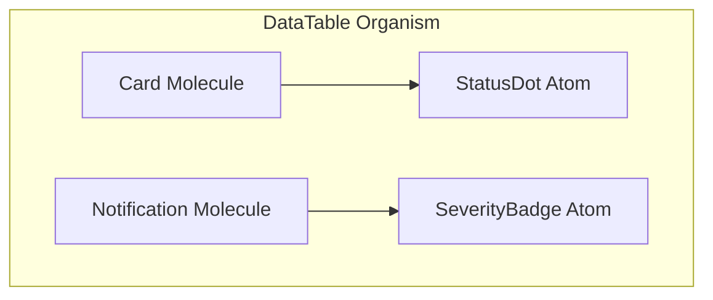

# Organisms

**Tier:** Organisms — Complex UI Sections

## Definition

Organisms are complex UI sections composed of multiple molecules and atoms. They represent discrete, recognizable pieces of an interface with significant logic, state, or data interactions.

### Characteristics

- **Complex composition:** Multiple molecules and/or atoms
- **Significant state/logic:** Internal data processing or complex interactions
- **Data interactions:** May fetch, display, or manipulate data
- **Discrete sections:** Form recognizable interface pieces
- **Self-contained:** Complete functional units within a page

## Organism Components in Astra

The organism tier contains 33 complex components including:

| Component              | Purpose                                     | Complexity |
| ---------------------- | ------------------------------------------- | ---------- |
| `DataTable`            | Tabular data display with sorting/filtering | High       |
| `TimelineNode`         | Chronological event display                 | Medium     |
| `FileTree`             | Hierarchical file navigation                | Medium     |
| `StatusListRow`        | Status display with actions                 | Low        |
| `AlertListItem`        | Alert item with interactions                | Low        |
| `OperationHealthPanel` | Health status dashboard                     | High       |
| `SummaryListItem`      | Summary item display                        | Low        |

## Classification Rules

A component qualifies as an **organism** if it:

1. Contains 3+ molecules OR multiple atom types
2. Has significant state management or data logic
3. May perform data fetching or API calls
4. Represents a discrete UI section
5. Is self-contained within a page context

## Usage Patterns

### In Page Components

```typescript
import { DataTable } from '@/common/components/organisms/DataTable';
import { TimelineNode } from '@/common/components/organisms/TimelineNode';

// Organisms used in page-level components
const DashboardPage = () => (
  <Box>
    <SummaryPanel />
    <DataTable data={metrics} />
    <TimelineNode events={history} />
  </Box>
);
```

### Composition Structure



## Anti-Patterns

### ❌ Organisms Doing Too Much

```typescript
// ✗ BAD: Too many responsibilities
const Dashboard = () => {
  // User management
  // Settings
  // Notifications
  // File uploads
  // Analytics
  // This should be multiple organisms
};
```

### ❌ Organisms Should Be Molecules

```typescript
// ✗ BAD: This is just a card with a badge
const SimpleMetricCard = ({ value, label }) => (
  <Card>
    <Typography>{value}</Typography>
    <Typography>{label}</Typography>
  </Card>
);
// This is a molecule, not an organism
```

### ❌ Organisms With Layout

```typescript
// ✗ BAD: Layout belongs in templates
const FullPageSection = ({ children }) => (
  <Box sx={{ display: 'flex', flexDirection: 'column' }}>
    <PageHeader />
    {children}
    <Footer />
  </Box>
);
// This is a template, not an organism
```

## Design Checklist

Before creating an organism, verify:

- [ ] Does it compose 3+ molecules or multiple atom types?
- [ ] Does it have significant state or data logic?
- [ ] Does it interact with data (fetch, display, manipulate)?
- [ ] Does it represent a discrete UI section?
- [ ] Is it self-contained within page context?
- [ ] Is it NOT just a larger molecule or a layout?

## Performance Considerations

- Organisms may be memoized to prevent unnecessary re-renders
- Data fetching should use React Query or similar patterns
- Complex interactions may need debouncing/throttling

## Related Tiers

- **Composed from:** [Molecules](./molecules.md) + [Atoms](./atoms.md)
- **Composed into:** [Templates](./templates.md)

## Next: Templates

Templates arrange organisms into page-level layouts with defined composition rules.
