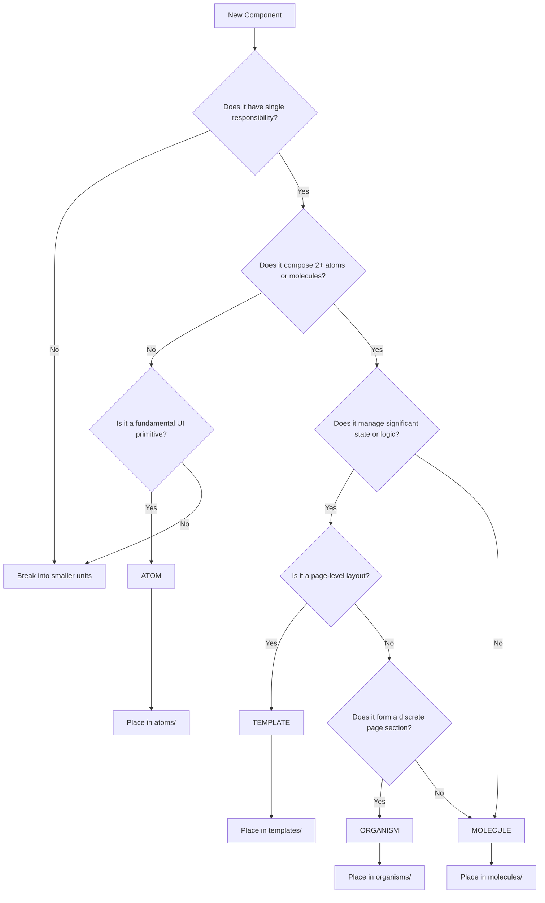

# Atomic Design Methodology

**Purpose:** Establishes classification rules for UI components in Astra, ensuring consistent composition patterns across the library.

## Overview

Atomic Design provides a methodology for constructing user interfaces by breaking them down into discrete, composable units. Originally developed by Brad Frost, this approach structures components from simple primitives to complex compositions.

### Why Atomic Design for Astra?

- **Predictability:** Components follow explicit classification rules
- **Reusability:** Clear boundaries enable confident composition
- **Maintainability:** Components are easier to locate and modify
- **Onboarding:** New contributors understand where to place new components

## Tier Definitions

| Tier          | Definition                                                                                             | Examples                                                  |
| ------------- | ------------------------------------------------------------------------------------------------------ | --------------------------------------------------------- |
| **Atoms**     | The smallest, most fundamental UI elements. Single responsibility, no child components, minimal props. | Buttons, icons, labels, badges, status indicators         |
| **Molecules** | Composed of 2+ atoms. Single functional purpose, self-contained units.                                 | Cards, notifications, form inputs, metric displays        |
| **Organisms** | Complex UI sections. Multiple molecules/atoms, significant state or logic, discrete page sections.     | Data tables, timelines, file trees, forms                 |
| **Templates** | Page-level layouts. Define structure, composition rules, and how organisms fit together.               | Page headers, summary panels, hero sections, file viewers |

## Decision Flowchart

Use this flowchart to classify new components:



## Design Principles

### 1. Single Responsibility Per Tier

Each component has one job appropriate to its tier:

- **Atoms:** Render a single primitive (color, shape, label)
- **Molecules:** Compose atoms into functional units
- **Organisms:** Assemble molecules into coherent sections
- **Templates:** Arrange organisms into page layouts

### 2. Composition Over Inheritance

Build complex UI from simple pieces:

```typescript
// ✓ Correct: Composition
const Card = ({ children }) => (
  <Box sx={cardStyles}>
    {children}
  </Box>
);

// ✗ Avoid: Monolithic components
const Card = ({ title, body, actions, footer }) => (...)
```

### 3. Explicit Over Implicit

Classification must be obvious from component purpose:

- **Good:** `StatusDot` is an atom (single status indicator)
- **Ambiguous:** `MetricDisplay` (could be molecule or organism)
- **Rule:** When uncertain, prefer simpler tier

### 4. Documentation With Examples

Every component document links to:

- Its tier guide (`atomic-design/atoms.md`, etc.)
- Concrete examples of similar components
- Usage patterns for composition

### 5. Verification On Check-In

Before adding a component:

1. Identify its tier using the flowchart
2. Confirm similar components exist in that tier
3. Verify it follows tier-specific patterns
4. Add to appropriate index.ts barrel export

## Anti-Patterns

### Atoms Anti-Patterns

- Atoms with >5 props (likely needs composition)
- Atoms containing other components
- Atoms with complex state logic
- Atoms with side effects

### Molecules Anti-Patterns

- Molecules that don't compose atoms
- Molecules with significant data fetching
- Molecules managing complex state
- Molecules exceeding 200 lines

### Organisms Anti-Patterns

- Organisms that should be molecules (over-composition)
- Organisms doing too much (split into organisms)
- Organisms with no clear single purpose
- Organisms exceeding 500 lines

### Templates Anti-Patterns

- Templates with content (should be organisms)
- Templates managing application state
- Templates with business logic
- Templates specific to one page (make it an organism)

## Related Guides

- [Atoms](./atoms.md) — Fundamental UI primitives
- [Molecules](./molecules.md) — Composed functional units
- [Organisms](./organisms.md) — Complex UI sections
- [Templates](./templates.md) — Page-level layouts

## External Resources

- [Atomic Design by Brad Frost](https://atomicdesign.bradfrost.com/)
- [Component Composition in React](https://react.dev/learn/composition)

## Responsibilities

- **Tier Classification:** Defining and enforcing classification rules for atoms, molecules, organisms, and templates
- **Composition Guidance:** Providing decision frameworks (flowchart, rules) for component placement
- **Pattern Documentation:** Maintaining composition patterns, anti-patterns, and design principles
- **Cross-Tier Boundaries:** Establishing clear boundaries between tiers and migration paths

## Non-Responsibilities

- **Code Enforcement:** Does not replace linting rules or automated tier validation
- **Visual Design:** Does not dictate aesthetic or visual styling decisions
- **API Contracts:** Does not replace component-level API documentation
- **Architecture:** Does not define page routing, state management, or application architecture

## Edge Cases

- **Multi-Tier Components:** Components that may belong to different tiers depending on context
- **Tier Migration:** Components that evolve from one tier to another over time
- **Shared Utilities:** Utility components that don't map to any specific tier
- **Wrapper Components:** External library wrappers that need custom classification

## States

- **Classified** — Component assigned to a tier (atom/molecule/organism/template) with clear placement
- **Ambiguous** — Component could fit multiple tiers; requires flowchart evaluation or discussion
- **Unclassified** — New component awaiting tier assignment; may be placed in wrong directory

## Inputs/Outputs

- **Inputs:** New or existing component to classify; component purpose, props, composition, and state requirements
- **Outputs:** Tier assignment (atom/molecule/organism/template); placement directory; composition rules and constraints

## Error Conditions

- **Wrong tier assignment** — Component placed in incorrect tier, causing composition or import issues
- **Boundary ambiguity** — Component straddling tier boundaries with no clear classification path
- **Missing classification** — Component added without tier review, bypassing design checklist
- **Migration failure** — Tier upgrade/downgrade causes import breakage across dependent components

## User Journey

### Entry Conditions
A developer needs to classify a new UI component or understand how existing components are organized.

### Primary Flow
The developer consults the tier definitions, follows the decision flowchart, and assigns the component to atoms, molecules, organisms, or templates.

### Alternate Flows
A developer reviews the anti-patterns section to avoid common classification mistakes before creating a new component.

### Failure Flows
A component is placed in the wrong tier, causing composition issues or import violations downstream.

### Recovery Flows
The developer re-evaluates using the flowchart, moves the component to the correct tier, and updates imports.

### Exit Conditions
The component is correctly classified and placed in the appropriate tier directory.

## Workflow

### Trigger
A new UI component is proposed or an existing component needs classification.

### Preconditions
The component has a defined purpose, props, composition structure, and state requirements.

### Steps
The developer evaluates the component against tier definitions, follows the decision flowchart, assigns a tier, and places it in the corresponding directory.

### Outcomes
The component is consistently classified and composable with other components at the appropriate tier level.

### Exceptions
The component straddles tier boundaries — the developer consults the ambiguous classification guidance and uses the simpler tier as a default.

### Completion Criteria
The component is assigned to a tier, placed in the correct directory, and its classification is documented.

## Future Enhancements

- Automated tier validation in CI — lint rule that verifies component classification
- Tier-migration codemod that automatically updates imports when a component moves
- Visual dependency graph showing tier composition relationships
- Storybook integration per tier for isolated development and documentation

## Open Questions

- How should headless / render-prop components be classified in the atomic hierarchy?
- Is a fifth tier needed for page-specific compositions that sit above templates?
- Should the classification flowchart be encoded as an interactive CLI tool or in-editor hint?
